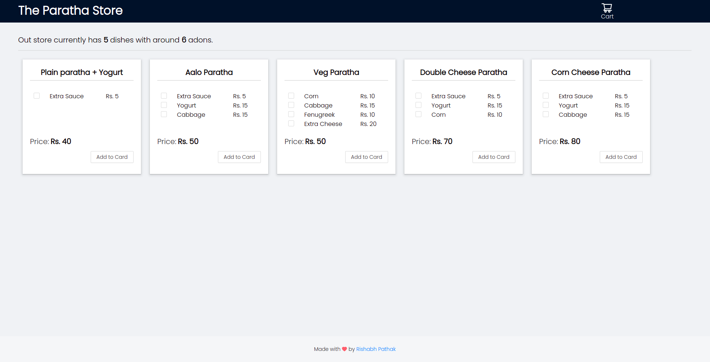
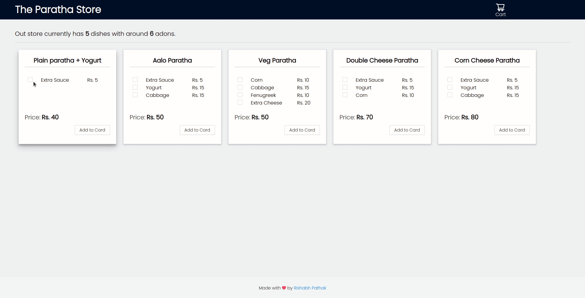
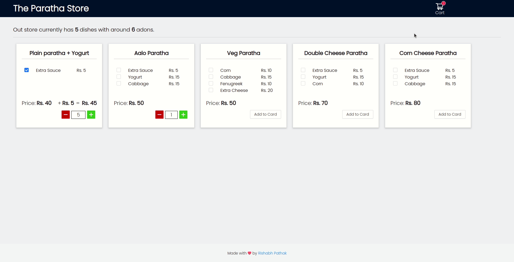
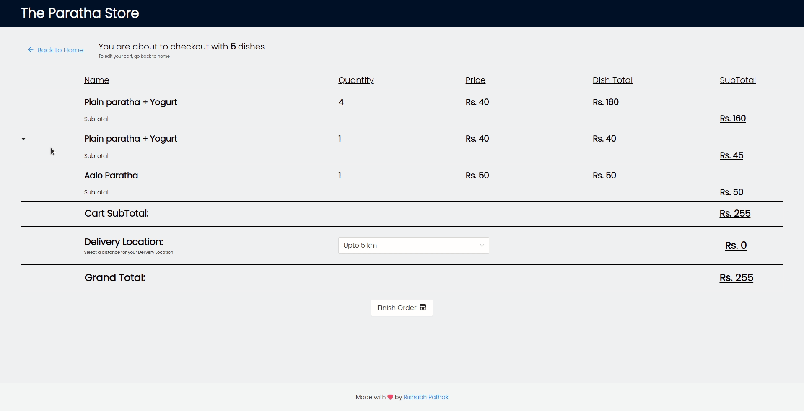

# The paratha store

## Introduction

This project is built to recreate a simple checkout system with different products that have addon items and handle the checkout process with addons.

## Running the project locally

### install the dependencies

- Yarn :

  ```console
    yarn install
  ```

- npm:

  ```console
    npm install
  ```

### Run the project

This project has json-server so, you have two ways to run it.
Either run it with the `dev` script, which runs `react-script` and `json-server` concurrently or  run it with `json-server` script which runs json-server and then run the `start` script which starts the React App.

- json-server runs on  port `5000`, you can change this from `json-server` (package.json)

- React app runs on port `3000`

#### Dev (concurrently)

Yarn:

```console
  yarn dev
```

OR

Npm:

```console
  npm run dev
```

#### Separately

- First,run the `json-server` script in this project's terminal
  - npm: `npm run json-server`
  - yarn: `yarn json-server`

- Then, in another terminal run the `start` script
  - npm: `npm run start`
  - yarn: `yarn start`

## Screenshots

### Home Page

  

  On this page you can see the whole list of dishes and their prices.
  
  You can also view what addons are available with a dish and that addon's price.

### Add To Cart

  

  To add a dish to the cart, click on the Add to Cart button below that Dish.

  Each dish with a different set of addons is a different item inside your cart.

### Proceed To Checkout

  

  Click on the Cart Icon on the Top Right of your page.

  You can see a list of all the dishes you've added in your cart  with their respective addons.

  You can also change the quantity of that dish in your cart from the `Plus` and `Minus` Buttons.

  Finally, you'll see the subtotal of your cart and a `Proceed to Checkout` button below that  list.
  Clicking on that button will take you to the `Checkout` Page.

### Checkout

  

  On this page you can see a table which looks similar to the one in your `Cart`. At the bottom of this page you can see a Delivery Range dropdown which adds a delivery fee to your total amount.

  Below the table you can see a `Finish Order` button. Clicking on that button will take you back to the `Home` Page with an empty Cart and a message which says that your Order has been Placed with the number of Dishes you ordered

## Available Scripts

This project was bootstrapped with [Create React App](https://github.com/facebook/create-react-app).

In the project directory, you can run:

### `npm start`

Runs the app in the development mode.\
Open [http://localhost:3000](http://localhost:3000) to view it in your browser.

The page will reload when you make changes.\
You may also see any lint errors in the console.

### `npm test`

Launches the test runner in the interactive watch mode.\
See the section about [running tests](https://facebook.github.io/create-react-app/docs/running-tests) for more information.

### `npm run build`

Builds the app for production to the `build` folder.\
It correctly bundles React in production mode and optimizes the build for the best performance.

The build is minified and the filenames include the hashes.\
Your app is ready to be deployed!

See the section about [deployment](https://facebook.github.io/create-react-app/docs/deployment) for more information.

### `npm run eject`

**Note: this is a one-way operation. Once you `eject`, you can't go back!**

If you aren't satisfied with the build tool and configuration choices, you can `eject` at any time. This command will remove the single build dependency from your project.

Instead, it will copy all the configuration files and the transitive dependencies (webpack, Babel, ESLint, etc) right into your project so you have full control over them. All of the commands except `eject` will still work, but they will point to the copied scripts so you can tweak them. At this point you're on your own.

You don't have to ever use `eject`. The curated feature set is suitable for small and middle deployments, and you shouldn't feel obligated to use this feature. However we understand that this tool wouldn't be useful if you couldn't customize it when you are ready for it.

## Learn More

You can learn more in the [Create React App documentation](https://facebook.github.io/create-react-app/docs/getting-started).

To learn React, check out the [React documentation](https://reactjs.org/).

### Code Splitting

This section has moved here: [https://facebook.github.io/create-react-app/docs/code-splitting](https://facebook.github.io/create-react-app/docs/code-splitting)

### Analyzing the Bundle Size

This section has moved here: [https://facebook.github.io/create-react-app/docs/analyzing-the-bundle-size](https://facebook.github.io/create-react-app/docs/analyzing-the-bundle-size)

### Making a Progressive Web App

This section has moved here: [https://facebook.github.io/create-react-app/docs/making-a-progressive-web-app](https://facebook.github.io/create-react-app/docs/making-a-progressive-web-app)

### Advanced Configuration

This section has moved here: [https://facebook.github.io/create-react-app/docs/advanced-configuration](https://facebook.github.io/create-react-app/docs/advanced-configuration)

### Deployment

This section has moved here: [https://facebook.github.io/create-react-app/docs/deployment](https://facebook.github.io/create-react-app/docs/deployment)

### `npm run build` fails to minify

This section has moved here: [https://facebook.github.io/create-react-app/docs/troubleshooting#npm-run-build-fails-to-minify](https://facebook.github.io/create-react-app/docs/troubleshooting#npm-run-build-fails-to-minify)
